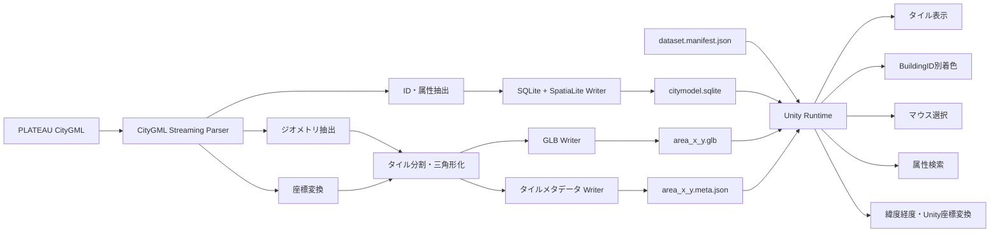
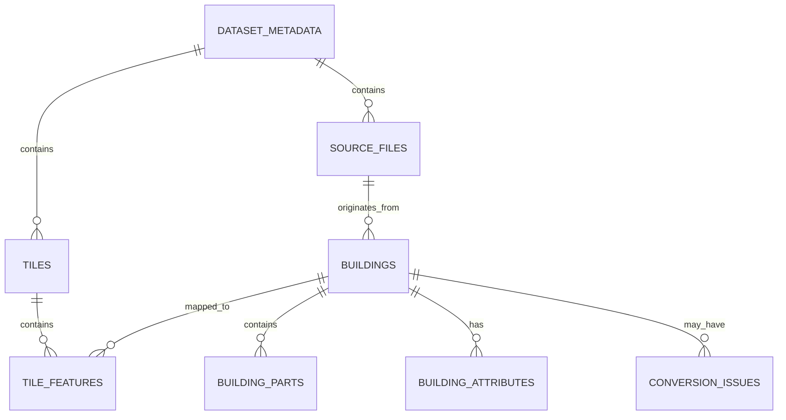

未確定の条件は「初期仮決定」として具体化し、後から差し替え可能な構成にしています。特に、**描画用のローカルFeature ID**と、**永続的なBuildingID**を分離する設計を採用しています。

# CityGML軽量GLB・SpatiaLite・Unity連携ライブラリ 要件定義書

**文書バージョン:** 0.1
**作成日:** 2026年8月27日
**文書状態:** 初期要件定義
**対象システム仮称:** CityModel Runtime Library
**主対象データ:** PLATEAU建築物CityGML
**主対象環境:** Windows 11 x64、Unity 6、URP

---

## 1. 文書の目的

本書は、CityGML形式の3D都市モデルから、Unityで高速に表示・着色・選択できる軽量GLB群と、建築物属性を検索できるSQLite＋SpatiaLiteデータベースを生成・利用するライブラリの要件を定義する。

本システムは、次の課題を解決することを目的とする。

1. XMLベースで容量と解析コストが大きいCityGMLを、Unityで扱いやすい軽量GLBへ事前変換する。
2. 大量の建物をGameObject単位に分割せず、結合メッシュのまま建物単位で高速に色分けする。
3. 結合されたメッシュをクリックした際に、元の建物のBuildingIDを取得する。
4. CityGMLに含まれる属性をSQLite＋SpatiaLiteへ直接格納し、UnityからBuildingIDまたは位置を使って検索する。
5. 緯度経度、投影座標、GLBローカル座標、Unityワールド座標の対応関係を明示的に保持する。
6. GeoPackageを中間形式として使用せず、CityGMLからGLBとSpatiaLiteデータベースを一貫して生成する。

PLATEAUはCityGML 2.0を応用スキーマとして採用しており、建物には年度をまたいで同一性を維持するための「建物ID」が用意されている。ただし、CityGMLの`gml:id`とは役割が異なるため、本システムでも両者を区別して管理する。([Open Geospatial Consortium][1])

---

## 2. システムの全体像

本システムは、大きく次の2製品から構成する。

| 製品                    | 役割                                                 |
| --------------------- | -------------------------------------------------- |
| CityGML Converter     | CityGMLを解析し、タイル単位のGLB、メタデータ、SQLite＋SpatiaLiteを生成する |
| Unity Runtime Package | GLB群、メタデータ、SpatiaLiteを読み込み、表示、座標変換、着色、選択、属性検索を提供する |

### 2.1 全体構成



---

## 3. 対象範囲

### 3.1 対象とする機能

本システムの対象範囲は次のとおりとする。

* PLATEAU建築物CityGMLの読み込み
* CityGMLのストリーミング解析
* 建物ID、GML ID、建物属性の抽出
* LOD別形状の抽出
* 投影座標への変換
* エリア単位のタイル分割
* 建物メッシュの結合
* 建物単位Feature IDのGLBへの格納
* GLB、タイルメタデータ、データセットマニフェストの出力
* SQLite＋SpatiaLiteへの直接投入
* UnityでのGLBランタイムロード
* GLBの地理的位置への配置
* Unity原点の変更およびFloating Origin対応
* 建物単位の高速な色変更
* マウス選択によるBuildingID取得
* BuildingIDによる属性検索
* 緯度経度または範囲による空間検索
* 変換結果の検証および診断レポート

### 3.2 初期対象外

初期版では、次の機能を対象外とする。

* CityGMLの編集および再出力
* UnityからSpatiaLiteへの属性更新
* 複数ユーザーによる同時DB更新
* WebGLでのSpatiaLite利用
* 人物、車両等の動的オブジェクト
* 建物内部空間の生成
* BIM／IFCとの双方向変換
* 地形、道路、橋梁、植生等の完全対応
* サーバー側のタイル配信サービス
* 3D Tiles形式の生成
* GLBからCityGMLへの逆変換

ただし、将来の拡張を妨げないインターフェース設計とする。

---

## 4. 前提条件と初期仮決定

未指定の条件について、初期版では次のように仮決定する。

| 項目            | 初期仮決定                                    |
| ------------- | ---------------------------------------- |
| 入力形式          | PLATEAU CityGML 2.0＋PLATEAU ADE          |
| 将来対応          | CityGML 3.0を追加可能なパーサー構造                  |
| 主対象地物         | `bldg:Building`、`bldg:BuildingPart`      |
| 標準LOD         | LOD1                                     |
| LOD選択         | 指定LODを優先し、存在しなければ設定に従ってフォールバック           |
| テクスチャ         | 初期版では原則除外                                |
| GLBタイルサイズ     | 500m×500mを既定値とし、設定変更可能                   |
| タイル境界建物       | 建物を切断せず、代表点が属するタイルへ建物全体を格納               |
| GLB内部構造       | タイル単位で結合メッシュ化                            |
| 建物識別          | タイル内Feature IDとBuildingIDを分離             |
| Feature ID型   | `UNSIGNED_SHORT`、0～65534を使用、65535を予約値とする |
| Unityレンダリング   | URPを初期必須対象とする                            |
| Unityバージョン    | Unity 6系                                 |
| Unityプラットフォーム | Windows x64                              |
| DB用途          | 変換後は原則読み取り専用                             |
| DB配置          | GLB群と同一データセット配下                          |
| 変換実装          | Rustを第一候補とする                             |
| Unity実装       | C#＋必要に応じてネイティブDLL                        |
| GLBロード        | Unity glTFastを標準アダプター候補とする               |
| 選択方式          | CPU MeshCollider方式を初期必須、GPU Pickingを拡張対象 |
| 原点            | データセット原点とタイル原点を分離                        |
| 高さ            | 高さ基準、垂直CRS、標高値をメタデータに明記                  |

PLATEAU CityGMLでは空間参照系が`gml:Envelope`で示され、代表的にはJGD2011のEPSG:6697、または高さを扱わない場合のEPSG:6668が使用される。このため、単に「緯度経度」とだけ記録せず、EPSGコード、軸順序、高さ基準を必ず併記する。([国土交通省][2])

---

## 5. 用語定義

| 用語                    | 定義                                      |
| --------------------- | --------------------------------------- |
| BuildingID            | 年度をまたいだ建物同一性を表す、PLATEAUの建物ID            |
| GML ID                | CityGML地物の`gml:id`                      |
| Canonical Building ID | データセットIDとBuildingIDを組み合わせたライブラリ内部の一意識別子 |
| Feature ID            | GLBタイル内で建物を識別する0始まりの整数                  |
| Dataset Origin        | Unityシーン全体の基準となる地理的位置                   |
| Tile Origin           | 各GLB内部のローカル座標原点に対応する地理的位置               |
| Working CRS           | 変換、タイル分割、DB格納に使用するメートル単位の投影座標系          |
| Source CRS            | CityGMLに記録された元の座標参照系                    |
| Scene Origin          | Unityワールド座標の原点に対応させる地理的位置               |
| Tile Bounds           | 規定のタイル領域                                |
| Content Bounds        | タイル内GLBが実際に占める範囲                        |
| Attribute Key         | CityGML属性を名前空間URIと要素パスで一意に識別するキー        |

---

## 6. 識別子の設計

### 6.1 BuildingIDの決定規則

建物のBuildingIDは、次の優先順位で決定する。

1. PLATEAUの永続的な建物ID属性
2. 設定ファイルで指定された自治体独自の建物ID属性
3. `gml:id`
4. データセットID、ソースファイル、地物位置等から生成した決定論的ID

4の方法で生成したIDは、`id_is_synthetic = true`として管理する。

### 6.2 IDの保持項目

各建物について、最低限次を保持する。

```text
dataset_id
canonical_building_id
building_id
gml_id
building_part_id
id_source
id_is_synthetic
tile_id
local_feature_id
```

### 6.3 BuildingPartの扱い

* `bldg:BuildingPart`は親Buildingに紐付ける。
* 標準の色変更単位は親Buildingとする。
* 選択結果では親BuildingIDに加え、該当する場合はBuildingPart IDも返せるものとする。
* 親Buildingの色を変更した場合、すべてのBuildingPartへ同じ色を適用する。
* 将来、BuildingPart単位の色変更を追加できる設計とする。

### 6.4 Feature ID

Feature IDはGLB内で使用するタイルローカル整数であり、BuildingIDそのものではない。

```text
Feature ID 0 → BuildingID 01100-bldg-000001
Feature ID 1 → BuildingID 01100-bldg-000002
Feature ID 2 → BuildingID 01100-bldg-000003
```

Feature IDはBuildingIDを辞書順に並べて決定し、同じ入力と設定からは同じ結果が生成されるものとする。

タイル内建物数が65,535件を超える場合は、タイルを自動分割する。

---

## 7. 機能要件

要件の優先度は次の記号で表す。

| 記号     | 意味          |
| ------ | ----------- |
| MUST   | 初期版に必須      |
| SHOULD | 初期版で実装を強く推奨 |
| COULD  | 将来拡張候補      |

---

## 7.1 CityGML入力要件

| ID         |    優先度 | 要件                                               |
| ---------- | -----: | ------------------------------------------------ |
| CVT-IN-001 |   MUST | 単一CityGMLファイルを入力できること                            |
| CVT-IN-002 |   MUST | PLATEAUデータセットのディレクトリを入力できること                     |
| CVT-IN-003 |   MUST | 複数の`udx/bldg`ファイルを一括処理できること                      |
| CVT-IN-004 |   MUST | XML名前空間のプレフィックスに依存せず、名前空間URIで要素を判定すること           |
| CVT-IN-005 |   MUST | XML全体をメモリへ展開せず、イベント駆動またはストリーミング方式で解析すること         |
| CVT-IN-006 |   MUST | `gml:pos`、`gml:posList`、`gml:LinearRing`を解析できること |
| CVT-IN-007 |   MUST | 同一ファイル内のXLink参照を解決できること                          |
| CVT-IN-008 | SHOULD | ファイルをまたぐXLink参照を解決できること                          |
| CVT-IN-009 |   MUST | `srsName`、`srsDimension`、座標軸順序を取得すること            |
| CVT-IN-010 |   MUST | 不正なXML、未対応要素、欠損IDを診断レポートへ記録すること                  |
| CVT-IN-011 |   MUST | DTDおよび外部エンティティの展開を無効化し、XXEを防止すること                |
| CVT-IN-012 | SHOULD | ZIP形式のPLATEAUデータを直接入力できること                       |
| CVT-IN-013 |   MUST | ZIP入力時にパストラバーサルおよび過大展開を防止すること                    |
| CVT-IN-014 |   MUST | 入力ファイルごとのSHA-256を記録すること                          |
| CVT-IN-015 | SHOULD | 中断した変換をファイル単位またはタイル単位で再開できること                    |

---

## 7.2 LODおよびジオメトリ抽出要件

| ID      |    優先度 | 要件                                                  |
| ------- | -----: | --------------------------------------------------- |
| GEO-001 |   MUST | LOD1建築物形状を抽出できること                                   |
| GEO-002 | SHOULD | LOD0およびLOD2を抽出できること                                 |
| GEO-003 |  COULD | LOD3を抽出できること                                        |
| GEO-004 |   MUST | 使用LODを設定ファイルまたはCLIで指定できること                          |
| GEO-005 |   MUST | 指定LODがない場合のフォールバック規則を設定できること                        |
| GEO-006 |   MUST | Polygon、MultiSurface、Solid、CompositeSurfaceを処理できること |
| GEO-007 |   MUST | 外周および内周を持つポリゴンを三角形化できること                            |
| GEO-008 |   MUST | 三角形化後もBuildingIDとの対応を保持すること                         |
| GEO-009 |   MUST | 面の向きと法線を検査し、必要に応じて補正すること                            |
| GEO-010 |   MUST | 縮退三角形、NaN、無限値を除外またはエラーとして報告すること                     |
| GEO-011 | SHOULD | 軽微な自己交差や閉じていないリングを修復できること                           |
| GEO-012 |   MUST | 修復した地物と修復内容を診断レポートに残すこと                             |
| GEO-013 |   MUST | 建物境界では頂点を共有せず、異なる建物のFeature IDが同じ頂点へ割り当てられないこと      |
| GEO-014 |   MUST | 同一建物内では、位置、法線、UV、Feature IDが同じ頂点を統合できること            |
| GEO-015 | SHOULD | LOD0＋建物高さから簡易LOD1を生成するオプションを持つこと                    |
| GEO-016 |   MUST | 生成されたLODか、CityGMLに元から存在したLODかを記録すること                |
| GEO-017 | SHOULD | 建物の接地面または投影輪郭を生成し、DBのFootprintとして使用できること            |
| GEO-018 |   MUST | Footprint生成方法と品質フラグをDBに保存すること                       |

---

## 7.3 座標変換要件

| ID      |    優先度 | 要件                                                 |
| ------- | -----: | -------------------------------------------------- |
| CRS-001 |   MUST | Source CRSをCityGMLから取得すること                         |
| CRS-002 |   MUST | Source CRSのEPSGコードまたはWKTを保存すること                    |
| CRS-003 |   MUST | Working CRSを設定で指定できること                             |
| CRS-004 |   MUST | 日本国内データでは、対象地域に適した平面直角座標系を自動選択できること                |
| CRS-005 |   MUST | 自動選択結果をログとマニフェストへ記録すること                            |
| CRS-006 |   MUST | 座標変換計算では倍精度浮動小数点を使用すること                            |
| CRS-007 |   MUST | GLBへ格納する直前にタイル原点との差分を求め、単精度へ変換すること                 |
| CRS-008 |   MUST | 緯度、経度、高さ、EPSG、軸順序、高さ基準を一体として管理すること                 |
| CRS-009 |   MUST | Dataset OriginとTile Originを別々に保持すること               |
| CRS-010 |   MUST | Tile Originを地理座標と投影座標の両方で保持すること                    |
| CRS-011 |   MUST | 投影座標からGLBローカル座標への変換行列を保持すること                       |
| CRS-012 |   MUST | GLBローカル座標からUnity座標への軸変換を定義すること                     |
| CRS-013 |   MUST | Unity座標から地理座標へ逆変換できること                             |
| CRS-014 |   MUST | Scene Originを変更してもGLBを再読み込みせず、タイルルートの再配置だけで対応できること |
| CRS-015 | SHOULD | Floating Originによる原点再設定を提供すること                     |
| CRS-016 |   MUST | 高さ基準が不明な場合は、不明であることを明示し、楕円体高と標高を混同しないこと            |
| CRS-017 |   MUST | CRS変換に必要なグリッドや定義が不足している場合は、暗黙に近似せず警告またはエラーとすること    |

glTFは右手系、Y-up、メートル単位で定義されるため、GLB内の軸とUnity内の軸を暗黙に扱わず、変換規則を固定して検証する。([Khronos Registry][3])

### 7.3.1 GLBローカル座標の既定規則

初期版では、次を標準とする。

```text
GLB X = Working CRSのEasting差分
GLB Y = 高さ差分
GLB Z = Working CRSのNorthing差分の符号反転
```

すなわち、

```text
X = East
Y = Up
Z = -North
```

とする。

実際の変換は固定の決め打ちではなく、メタデータ内の4×4変換行列を正とする。

---

## 7.4 タイル分割要件

| ID       |    優先度 | 要件                                     |
| -------- | -----: | -------------------------------------- |
| TILE-001 |   MUST | Working CRS上の正方グリッドで建物をタイル分割すること       |
| TILE-002 |   MUST | タイルサイズを設定可能とすること                       |
| TILE-003 |   MUST | 既定値を500mとすること                          |
| TILE-004 |   MUST | タイルIDが変換実行順に依存しないこと                    |
| TILE-005 |   MUST | 建物の代表点が属するタイルへ建物全体を配置すること              |
| TILE-006 |   MUST | 初期版では建物形状をタイル境界で切断しないこと                |
| TILE-007 |   MUST | Tile BoundsとContent Boundsを分けて記録すること   |
| TILE-008 |   MUST | タイル内建物数がFeature ID上限を超える場合、自動的に細分化すること |
| TILE-009 |   MUST | GLBサイズ、頂点数、三角形数の上限を設定できること             |
| TILE-010 |   MUST | 上限を超えたタイルを自動的に細分化できること                 |
| TILE-011 | SHOULD | 建物密度に応じた適応的タイル分割を提供すること                |
| TILE-012 |   MUST | タイルの隣接関係をマニフェストまたはDBから取得できること          |
| TILE-013 |   MUST | タイル原点をタイル中心付近に設定し、頂点座標の絶対値を抑えること       |
| TILE-014 | SHOULD | タイル原点のEasting、Northingを指定単位でスナップできること  |

---

## 7.5 GLB生成要件

| ID      |    優先度 | 要件                                                               |
| ------- | -----: | ---------------------------------------------------------------- |
| GLB-001 |   MUST | glTF 2.0 Binary形式の`.glb`を生成すること                                  |
| GLB-002 |   MUST | 1タイルを原則1GLBとして生成すること                                             |
| GLB-003 |   MUST | タイル内の建物を少数のMesh Primitiveへ結合すること                                 |
| GLB-004 |   MUST | 1建物1GameObjectまたは1建物1Rendererを前提としないこと                           |
| GLB-005 |   MUST | 頂点ごとにタイルローカルFeature IDを格納すること                                    |
| GLB-006 |   MUST | Feature ID属性のセマンティクスを`_FEATURE_ID_0`とすること                        |
| GLB-007 |   MUST | Feature IDアクセサを`SCALAR`、`UNSIGNED_SHORT`、`normalized=false`とすること |
| GLB-008 |   MUST | 同一三角形の3頂点が同じFeature IDを持つこと                                      |
| GLB-009 |   MUST | Feature IDとBuildingIDの対応をタイルメタデータへ保存すること                         |
| GLB-010 |   MUST | 位置、法線、インデックスを格納すること                                              |
| GLB-011 | SHOULD | 表示に不要なUV、接線、頂点カラーを除外すること                                         |
| GLB-012 |   MUST | テクスチャなしの軽量マテリアルプロファイルを持つこと                                       |
| GLB-013 | SHOULD | テクスチャを含む出力モードを追加できること                                            |
| GLB-014 | SHOULD | 頂点量子化またはMeshopt圧縮を選択可能にすること                                      |
| GLB-015 |   MUST | 圧縮後もFeature IDを完全に復元できること                                        |
| GLB-016 |   MUST | GLBごとにSHA-256を算出すること                                             |
| GLB-017 |   MUST | GLB生成後にglTF構造検証を行うこと                                             |
| GLB-018 |   MUST | GLBのAsset ExtrasにschemaVersion、tileId、generationIdを格納すること        |
| GLB-019 | SHOULD | `EXT_mesh_features`互換情報を任意出力できること                                |
| GLB-020 |   MUST | `EXT_mesh_features`の対応有無に関係なく、本ライブラリ単体でFeature IDを読み取れること        |

glTFではアプリケーション固有の頂点属性名をアンダースコアで開始できる一方、通常の頂点属性に`UNSIGNED_INT`は使用できない。このため、初期版では`_FEATURE_ID_0`と`UNSIGNED_SHORT`を採用する。([Khronos Registry][3])

`EXT_mesh_features`は、結合メッシュ内の地物をFeature IDで識別する考え方を定義しているが、参照仕様ではDraft扱いである。そのため、本システムのコア要件は同拡張への依存を避け、互換性出力としてのみ扱う。([GitHub][4])

---

## 7.6 メタデータ要件

メタデータは、データセット全体とタイル単位の2階層に分ける。

### 7.6.1 データセットマニフェスト

| ID       |    優先度 | 要件                                            |
| -------- | -----: | --------------------------------------------- |
| META-001 |   MUST | データセット直下に`dataset.manifest.json`を配置すること       |
| META-002 |   MUST | マニフェストのJSON Schemaを提供すること                     |
| META-003 |   MUST | schemaVersionを保持すること                          |
| META-004 |   MUST | datasetId、generationId、生成日時、変換ツールバージョンを保持すること |
| META-005 |   MUST | Source CRS、Working CRS、垂直CRSを保持すること           |
| META-006 |   MUST | Dataset Originを地理座標と投影座標で保持すること               |
| META-007 |   MUST | タイル一覧またはタイルインデックスへの参照を持つこと                    |
| META-008 |   MUST | SQLiteファイルへの相対パスとハッシュを持つこと                    |
| META-009 |   MUST | 入力ファイル、入力ハッシュ、変換設定を追跡できること                    |
| META-010 |   MUST | データライセンスおよび帰属表示を保持できること                       |
| META-011 |   MUST | 使用LOD、テクスチャ有無、圧縮方式、タイルサイズを保持すること              |
| META-012 | SHOULD | 変換時の警告件数と除外建物件数を保持すること                        |

### 7.6.2 タイルメタデータ

| ID         |    優先度 | 要件                                            |
| ---------- | -----: | --------------------------------------------- |
| META-T-001 |   MUST | GLBと同名の`.meta.json`を生成すること                    |
| META-T-002 |   MUST | tileId、generationId、GLB相対パス、GLBハッシュを保持すること    |
| META-T-003 |   MUST | Tile Originを緯度、経度、高さ、EPSG付きで保持すること            |
| META-T-004 |   MUST | Tile OriginをWorking CRS座標でも保持すること             |
| META-T-005 |   MUST | Tile BoundsとContent Boundsを保持すること             |
| META-T-006 |   MUST | Feature IDからBuildingIDへの配列を保持すること             |
| META-T-007 |   MUST | BuildingIDからFeature IDへの逆引きをUnityロード時に構築できること |
| META-T-008 |   MUST | Feature IDの頂点属性名と型を保持すること                     |
| META-T-009 |   MUST | 建物数、頂点数、三角形数、Primitive数を保持すること                |
| META-T-010 |   MUST | GLBローカル座標とWorking CRSの変換行列を保持すること             |
| META-T-011 |   MUST | 軸方向、単位、Handednessを保持すること                      |
| META-T-012 | SHOULD | BuildingPart IDの対応を保持すること                     |
| META-T-013 | SHOULD | JSONが大きくなった場合のバイナリFeature Map形式を追加できること       |

---

## 8. 出力ディレクトリ構成

```text
output/
├─ dataset.manifest.json
├─ citymodel.sqlite
├─ tiles/
│  ├─ t_000012_000034.glb
│  ├─ t_000012_000034.meta.json
│  ├─ t_000012_000035.glb
│  └─ t_000012_000035.meta.json
├─ schemas/
│  ├─ dataset-manifest.schema.json
│  └─ tile-metadata.schema.json
├─ reports/
│  ├─ conversion-summary.json
│  ├─ conversion-issues.jsonl
│  └─ performance.json
└─ licenses/
   ├─ DATASET_LICENSE.txt
   └─ THIRD_PARTY_NOTICES.txt
```

出力にはGeoPackageを含めない。

---

## 9. データセットマニフェスト仕様例

```json
{
  "schemaVersion": "1.0.0",
  "datasetId": "saitama-shadow-route-2026",
  "generationId": "01JEXAMPLEGENERATION",
  "generatedAt": "2026-08-27T06:00:00+09:00",
  "generator": {
    "name": "citymodel-converter",
    "version": "0.1.0"
  },
  "source": {
    "format": "CityGML",
    "profile": "PLATEAU",
    "citygmlVersion": "2.0",
    "files": 42
  },
  "coordinateReference": {
    "sourceCrs": {
      "epsg": 6697,
      "axisOrder": ["latitude", "longitude", "height"]
    },
    "workingCrs": {
      "epsg": 6677,
      "axisOrder": ["easting", "northing", "height"],
      "unit": "metre"
    },
    "verticalReference": {
      "type": "source-defined",
      "epsg": null,
      "geoidModel": null
    }
  },
  "datasetOrigin": {
    "geographic": {
      "latitude": 35.8617,
      "longitude": 139.6455,
      "height": 0.0,
      "epsg": 6697
    },
    "projected": {
      "x": 100000.0,
      "y": 25000.0,
      "z": 0.0,
      "epsg": 6677
    }
  },
  "tiling": {
    "scheme": "projected-grid",
    "defaultTileSizeMetres": 500.0,
    "buildingAssignment": "representative-point",
    "geometryClipping": false
  },
  "modelProfile": {
    "lod": 1,
    "textures": false,
    "featureIdSemantic": "_FEATURE_ID_0",
    "featureIdComponentType": "UNSIGNED_SHORT"
  },
  "database": {
    "path": "citymodel.sqlite",
    "sha256": "..."
  },
  "tiles": {
    "indexType": "inline",
    "items": [
      {
        "tileId": "t_000012_000034",
        "metadata": "tiles/t_000012_000034.meta.json"
      }
    ]
  }
}
```

---

## 10. タイルメタデータ仕様例

```json
{
  "schemaVersion": "1.0.0",
  "generationId": "01JEXAMPLEGENERATION",
  "tileId": "t_000012_000034",
  "content": {
    "glb": "t_000012_000034.glb",
    "sha256": "...",
    "byteLength": 12345678
  },
  "origin": {
    "geographic": {
      "latitude": 35.8621,
      "longitude": 139.6460,
      "height": 8.2,
      "epsg": 6697
    },
    "projected": {
      "x": 100250.0,
      "y": 25250.0,
      "z": 8.2,
      "epsg": 6677
    }
  },
  "coordinateFrame": {
    "unit": "metre",
    "handedness": "right",
    "xAxis": "east",
    "yAxis": "up",
    "zAxis": "south",
    "projectedToLocalMatrix": [
      1, 0, 0, -100250,
      0, 0, 1, -8.2,
      0, -1, 0, 25250,
      0, 0, 0, 1
    ]
  },
  "tileBounds": {
    "minX": 100000.0,
    "minY": 25000.0,
    "maxX": 100500.0,
    "maxY": 25500.0
  },
  "contentBounds": {
    "minX": 99982.5,
    "minY": 24995.2,
    "minZ": 5.1,
    "maxX": 100510.8,
    "maxY": 25508.7,
    "maxZ": 96.4
  },
  "features": {
    "semantic": "_FEATURE_ID_0",
    "componentType": "UNSIGNED_SHORT",
    "nullFeatureId": 65535,
    "buildingIds": [
      "01100-bldg-000001",
      "01100-bldg-000002",
      "01100-bldg-000003"
    ]
  },
  "statistics": {
    "buildingCount": 3,
    "vertexCount": 642,
    "triangleCount": 980,
    "primitiveCount": 1
  }
}
```

---

## 11. SQLite＋SpatiaLite生成要件

### 11.1 基本要件

| ID     |    優先度 | 要件                                        |
| ------ | -----: | ----------------------------------------- |
| DB-001 |   MUST | CityGMLからSQLite＋SpatiaLiteへ直接データを投入すること   |
| DB-002 |   MUST | GeoPackageを中間形式または最終形式として使用しないこと          |
| DB-003 |   MUST | CityGML解析イベントからDB Writerへ直接データを渡すこと       |
| DB-004 |   MUST | SQLiteファイル内にSpatiaLiteメタデータを初期化すること       |
| DB-005 |   MUST | 建物FootprintをSpatiaLite Geometry列として格納すること |
| DB-006 |   MUST | Geometry列のSRIDをWorking CRSと一致させること        |
| DB-007 |   MUST | 建物Geometry列にSpatial Indexを作成すること          |
| DB-008 |   MUST | BuildingIDへ一意インデックスを作成すること                |
| DB-009 |   MUST | GML ID、tileId、Feature IDへインデックスを作成すること    |
| DB-010 |   MUST | 属性キーとBuildingIDの複合インデックスを作成すること           |
| DB-011 |   MUST | ファイル単位または一定件数単位のトランザクションで投入すること           |
| DB-012 |   MUST | 変換完了後にDB整合性検査を実行すること                      |
| DB-013 |   MUST | 最終成果物を単一`.sqlite`ファイルとして確定すること            |
| DB-014 |   MUST | 未チェックポイントのWALファイルを成果物に残さないこと              |
| DB-015 |   MUST | `application_id`と`user_version`を設定すること    |
| DB-016 |   MUST | DBスキーマのマイグレーション機構を持つこと                    |
| DB-017 |   MUST | 属性の型、単位、codeSpace、名前空間を保持すること             |
| DB-018 |   MUST | 同名の繰り返し属性を失わないこと                          |
| DB-019 | SHOULD | 属性カタログを生成し、利用可能な属性一覧を取得できること              |
| DB-020 |   MUST | 変換エラーのため除外した建物をDBまたはレポートで確認できること          |

SpatiaLiteはSQLiteにSpatial SQL機能を追加するライブラリであり、空間インデックスにはSQLiteのR*Treeが利用される。空間検索を有効にするGeometry列は、SpatiaLiteの空間メタデータへ登録し、Spatial Indexを作成する。([Gaia GIS][5])

### 11.2 推奨DBスキーマ



### 11.3 `buildings`テーブル

| 列                     | 型                | 内容                            |
| --------------------- | ---------------- | ----------------------------- |
| building_id           | TEXT PRIMARY KEY | データセット内BuildingID             |
| canonical_building_id | TEXT UNIQUE      | データセットIDを含む一意ID               |
| gml_id                | TEXT             | 元のGML ID                      |
| id_source             | TEXT             | plateau、custom、gml、synthetic等 |
| id_is_synthetic       | INTEGER          | 合成IDか                         |
| source_file_id        | INTEGER          | 入力ファイル                        |
| tile_id               | TEXT             | 所属タイル                         |
| local_feature_id      | INTEGER          | タイル内Feature ID                |
| lod_used              | INTEGER          | GLB生成に使用したLOD                 |
| lod_generated         | INTEGER          | 生成LODか                        |
| measured_height       | REAL             | 建物高さ                          |
| min_height            | REAL             | 最低高さ                          |
| max_height            | REAL             | 最高高さ                          |
| centroid_x            | REAL             | Working CRS X                 |
| centroid_y            | REAL             | Working CRS Y                 |
| centroid_lon          | REAL             | 地理座標の経度                       |
| centroid_lat          | REAL             | 地理座標の緯度                       |
| footprint_quality     | TEXT             | source、derived、repaired等      |
| attributes_json       | TEXT             | 元属性の補助的JSON表現                 |
| footprint             | GEOMETRY         | SpatiaLite Geometry列          |

### 11.4 `building_attributes`テーブル

| 列              | 型                   | 内容                     |
| -------------- | ------------------- | ---------------------- |
| id             | INTEGER PRIMARY KEY | 行ID                    |
| building_id    | TEXT                | BuildingID             |
| namespace_uri  | TEXT                | 名前空間URI                |
| attribute_path | TEXT                | 要素パス                   |
| attribute_key  | TEXT                | 正規化キー                  |
| ordinal        | INTEGER             | 同一属性の出現順               |
| value_type     | TEXT                | string、integer、double等 |
| value_text     | TEXT                | 文字列値                   |
| value_integer  | INTEGER             | 整数値                    |
| value_real     | REAL                | 実数値                    |
| value_boolean  | INTEGER             | 真偽値                    |
| value_datetime | TEXT                | 日時値                    |
| uom            | TEXT                | 単位                     |
| code_space     | TEXT                | コード体系                  |
| nil_reason     | TEXT                | 欠損理由                   |

### 11.5 `tile_features`テーブル

```sql
CREATE TABLE tile_features (
    tile_id TEXT NOT NULL,
    local_feature_id INTEGER NOT NULL,
    building_id TEXT NOT NULL,
    building_part_id TEXT,
    PRIMARY KEY (tile_id, local_feature_id),
    FOREIGN KEY (building_id) REFERENCES buildings(building_id)
);
```

### 11.6 空間検索

最低限、次の検索を提供する。

* 指定緯度経度を含む建物
* 指定矩形範囲内の建物
* 指定点から一定距離内の建物
* 指定タイル内の建物
* BuildingIDからFootprintを取得
* BuildingIDから重心、Bounding Box、高さを取得

---

## 12. 変換CLI要件

### 12.1 コマンド

```text
citymodel convert
citymodel validate
citymodel inspect
citymodel benchmark
citymodel schema
```

### 12.2 変換例

```bash
citymodel convert \
  --input "C:\plateau\city-model" \
  --output "C:\citymodel-runtime\saitama" \
  --dataset-id "saitama-2026" \
  --lod 1 \
  --tile-size 500 \
  --working-crs auto \
  --textures none \
  --database spatialite \
  --threads auto
```

### 12.3 設定ファイル

TOMLまたはJSONによる設定ファイルを使用できること。

```toml
dataset_id = "saitama-2026"
lod = 1
tile_size_metres = 500.0
textures = "none"
working_crs = "auto"
strict_mode = false

[id_resolution]
plateau_building_id = true
fallback_to_gml_id = true
allow_synthetic_id = true

[limits]
max_buildings_per_tile = 65535
max_glb_bytes = 134217728
max_vertices_per_tile = 4000000
```

### 12.4 実行結果

変換結果として次を表示および記録する。

* 処理ファイル数
* 検出建物数
* 出力建物数
* 除外建物数
* タイル数
* 入力容量
* GLB総容量
* DB容量
* 変換時間
* 最大メモリ
* 警告およびエラー件数
* CRSおよび選択された平面直角座標系
* LODごとの建物数
* 合成BuildingID件数

---

## 13. Unity Runtime要件

### 13.1 パッケージ構成

```text
Packages/
└─ com.example.citymodel/
   ├─ Runtime/
   │  ├─ Dataset/
   │  ├─ Georeference/
   │  ├─ Rendering/
   │  ├─ Picking/
   │  ├─ Database/
   │  └─ Native/
   ├─ Editor/
   ├─ Shaders/
   ├─ Samples~/
   ├─ Tests/
   └─ Documentation~/
```

パッケージ名は実際の組織名に合わせて変更する。

### 13.2 GLBロード

| ID             |    優先度 | 要件                                                |
| -------------- | -----: | ------------------------------------------------- |
| UNITY-LOAD-001 |   MUST | データセットマニフェストを非同期に読み込めること                          |
| UNITY-LOAD-002 |   MUST | ローカルファイルシステムからGLBを読み込めること                         |
| UNITY-LOAD-003 |   MUST | StreamingAssetsから読み込めること                          |
| UNITY-LOAD-004 | SHOULD | HTTPから読み込めるDataSourceを追加可能にすること                   |
| UNITY-LOAD-005 |   MUST | GLBロードをキャンセルできること                                 |
| UNITY-LOAD-006 |   MUST | 複数タイルの同時ロード数を制限できること                              |
| UNITY-LOAD-007 |   MUST | フレームを長時間停止させない遅延インスタンス化を行うこと                      |
| UNITY-LOAD-008 |   MUST | GLBハッシュとメタデータのハッシュを検証できること                        |
| UNITY-LOAD-009 |   MUST | generationIdが一致しないGLB、メタデータ、DBの組合せを拒否すること         |
| UNITY-LOAD-010 |   MUST | glTFインポーターがカスタム頂点属性を公開しない場合でもFeature IDを取得できること   |
| UNITY-LOAD-011 |   MUST | Feature IDアクセサの抽出を独自GLBパーサーまたはglTFインポート拡張で行うこと    |
| UNITY-LOAD-012 |   MUST | Unity Mesh内でもFeature IDを精度劣化なく保持すること              |
| UNITY-LOAD-013 |   MUST | タイルアンロード時にMesh、Material、Buffer、Colliderを確実に解放すること |

Unity glTFastはglTF 2.0のUnity向けロード機能を提供し、速度とメモリ効率を重視しているため、標準GLBロードアダプターの候補とする。ただし、Building Feature属性については本ライブラリ側で明示的に扱う。([Unity ドキュメント][6])

---

## 14. Unity地理参照要件

### 14.1 データセット原点

メタデータロード完了後、次を取得できること。

```csharp
GeoCoordinate DatasetOrigin { get; }
ProjectedCoordinate DatasetProjectedOrigin { get; }
CoordinateReferenceInfo CoordinateReference { get; }
```

### 14.2 Scene Origin

Scene Originは次の方法で設定できること。

* データセット原点を自動使用
* 緯度経度を明示指定
* 投影座標を明示指定
* 任意の建物の重心を原点として指定
* カメラ位置を基準に再設定

### 14.3 タイル配置

GLB頂点そのものを毎回書き換えるのではなく、タイルルートのTransformを次の概念で計算する。

```text
TileRootPosition
    = ProjectedToUnity(
        TileProjectedOrigin - SceneProjectedOrigin
      )
```

これにより、原点変更時はタイルルートの位置だけを再計算する。

### 14.4 座標変換API

```csharp
public interface IGeoReference
{
    GeoCoordinate SceneOrigin { get; }

    Vector3 GeoToUnity(GeoCoordinate coordinate);

    GeoCoordinate UnityToGeo(Vector3 unityPosition);

    Vector3 ProjectedToUnity(ProjectedCoordinate coordinate);

    ProjectedCoordinate UnityToProjected(Vector3 unityPosition);

    void SetSceneOrigin(GeoCoordinate origin);

    event Action<GeoCoordinate> SceneOriginChanged;
}
```

### 14.5 精度

* 地理座標、投影座標、タイル原点の計算は`double`を使用する。
* UnityのTransformへ設定する段階で`float`へ変換する。
* タイル内部の頂点座標は原則としてタイル原点から1km以内に収める。
* Scene Originから離れた場合はFloating Originを実行可能とする。

---

## 15. タイル管理要件

| ID             |    優先度 | 要件                                     |
| -------------- | -----: | -------------------------------------- |
| UNITY-TILE-001 |   MUST | tileIdを指定してロードできること                    |
| UNITY-TILE-002 |   MUST | 緯度経度と半径を指定して対象タイルをロードできること             |
| UNITY-TILE-003 |   MUST | 投影座標の矩形範囲を指定してロードできること                 |
| UNITY-TILE-004 |   MUST | カメラ位置に応じて自動ロード・アンロードできること              |
| UNITY-TILE-005 |   MUST | ロード距離とアンロード距離を別に設定できること                |
| UNITY-TILE-006 |   MUST | ロード済み、ロード中、未ロード、失敗の状態を取得できること          |
| UNITY-TILE-007 |   MUST | メモリ上限を設定できること                          |
| UNITY-TILE-008 | SHOULD | LRU方式のタイルキャッシュを持つこと                    |
| UNITY-TILE-009 |   MUST | 同じタイルを重複ロードしないこと                       |
| UNITY-TILE-010 |   MUST | Scene Origin変更時に全ロード済みタイルを再配置すること      |
| UNITY-TILE-011 |   MUST | Content Boundsを使ってFrustum Cullingできること |
| UNITY-TILE-012 | SHOULD | タイルのプリフェッチを行えること                       |

---

## 16. 建物単位の色変更要件

### 16.1 基本方針

建物ごとのRendererやMaterialを生成せず、次の方式で色を変更する。

```text
BuildingID
    ↓
Tile ID + Local Feature ID
    ↓
タイル内Color Table
    ↓
GraphicsBuffer
    ↓
ShaderがFeature IDで色を参照
```

Unityの`GraphicsBuffer`はStructured BufferとしてShaderから参照できるため、タイル内Feature IDを色配列の添字として使用する。([Unity ドキュメント][7])

### 16.2 色変更API

```csharp
public readonly record struct BuildingColor(
    string BuildingId,
    Color32 Color
);

public interface IBuildingColorService
{
    BuildingColorResult SetBuildingColor(
        string buildingId,
        Color32 color
    );

    BuildingColorBatchResult SetBuildingColors(
        IReadOnlyList<BuildingColor> colors
    );

    bool ClearBuildingColor(string buildingId);

    void ClearAllBuildingColors();

    bool TryGetBuildingColor(
        string buildingId,
        out Color32 color
    );
}
```

### 16.3 機能要件

| ID        |    優先度 | 要件                                             |
| --------- | -----: | ---------------------------------------------- |
| COLOR-001 |   MUST | BuildingIDと色を指定して建物の色を変更できること                  |
| COLOR-002 |   MUST | 複数BuildingIDを一括変更できること                         |
| COLOR-003 |   MUST | 未ロードタイル内の建物に対する色指定を保持できること                     |
| COLOR-004 |   MUST | 該当タイルのロード時に保持済みの色を自動適用すること                     |
| COLOR-005 |   MUST | タイルアンロード後も色指定を維持できること                          |
| COLOR-006 |   MUST | 色指定を個別解除できること                                  |
| COLOR-007 |   MUST | すべての色指定を解除できること                                |
| COLOR-008 |   MUST | デフォルト色を設定できること                                 |
| COLOR-009 |   MUST | 1建物1Materialを生成しないこと                           |
| COLOR-010 |   MUST | RendererごとのMaterialPropertyBlock更新を基本方式としないこと  |
| COLOR-011 |   MUST | Feature IDごとの色テーブルをGPUへ渡すこと                    |
| COLOR-012 |   MUST | 更新があった範囲だけColor Bufferを部分更新できること               |
| COLOR-013 |   MUST | 同一フレーム中の更新をまとめてGPUへ反映すること                      |
| COLOR-014 |   MUST | 色変更APIをメインスレッド外から呼んだ場合、安全にメインスレッドへキューイングすること   |
| COLOR-015 | SHOULD | 元マテリアルとの乗算、置換、オーバーレイを選択できること                   |
| COLOR-016 | SHOULD | 一時的な選択ハイライトを通常色とは別レイヤーで持つこと                    |
| COLOR-017 | SHOULD | アルファ値による半透明表示を選択可能とすること                        |
| COLOR-018 |   MUST | 半透明を使用しない場合はOpaque描画とバッチングを維持すること              |
| COLOR-019 |   MUST | 存在しないBuildingIDを指定した場合、明示的な結果を返すこと             |
| COLOR-020 |   MUST | 同じBuildingIDに複数BuildingPartがある場合、すべて同じ色を適用すること |

### 16.4 色変更結果

```csharp
public enum BuildingColorStatus
{
    AppliedToLoadedTile,
    StoredForUnloadedTile,
    BuildingNotFound,
    InvalidColor,
    DatasetNotReady
}
```

---

## 17. 建物選択要件

### 17.1 選択結果

```csharp
public readonly record struct BuildingPickResult
{
    public string BuildingId { get; init; }
    public string? BuildingPartId { get; init; }
    public string TileId { get; init; }
    public int LocalFeatureId { get; init; }

    public Vector3 UnityPosition { get; init; }
    public GeoCoordinate GeographicPosition { get; init; }

    public Vector3 Normal { get; init; }
    public float Distance { get; init; }
}
```

### 17.2 CPU Picking

初期版では、次の処理を標準とする。

```text
マウス座標
  ↓
Camera.ScreenPointToRay
  ↓
Physics.Raycast
  ↓
RaycastHit.triangleIndex
  ↓
Triangle → Local Feature ID
  ↓
Local Feature ID → BuildingID
```

Unityの`RaycastHit.triangleIndex`はMeshColliderにヒットした場合に三角形番号を返すため、実際のCollider Meshの三角形順とFeature IDの対応表を保持する。([Unity ドキュメント][8])

### 17.3 選択機能要件

| ID       |    優先度 | 要件                                             |
| -------- | -----: | ---------------------------------------------- |
| PICK-001 |   MUST | マウス位置から建物を選択できること                              |
| PICK-002 |   MUST | 選択建物のBuildingIDを取得できること                        |
| PICK-003 |   MUST | 該当する場合はBuildingPart IDも取得できること                 |
| PICK-004 |   MUST | 選択位置をUnity座標と地理座標で取得できること                      |
| PICK-005 |   MUST | Collider Meshの三角形番号とFeature IDの対応表を保持すること      |
| PICK-006 |   MUST | Renderer Meshのインデックス順を暗黙にCollider Meshへ流用しないこと |
| PICK-007 |   MUST | GLBロード時にColliderと対応表を同時生成すること                  |
| PICK-008 | SHOULD | 表示用より簡略化したPicking Meshを使用できること                 |
| PICK-009 |   MUST | MeshCollider生成によるフレーム停止を抑制すること                 |
| PICK-010 | SHOULD | Hover選択を提供すること                                 |
| PICK-011 | SHOULD | 複数ヒットを距離順で返せること                                |
| PICK-012 | SHOULD | 選択対象レイヤーを指定できること                               |
| PICK-013 | SHOULD | GPU ID Buffer方式のPickingを追加できること                |
| PICK-014 | SHOULD | GPU Pickingでは非同期Readbackを使用し、許容遅延を3フレーム以内とすること |
| PICK-015 |   MUST | 選択結果のBuildingIDがタイルメタデータおよびDBと一致すること           |

MeshColliderの生成にはMesh Cookingが必要で、ランタイム生成はCPUスパイクの原因になり得るため、タイルロード処理での分割実行、簡易Picking Mesh、将来のGPU Pickingを考慮する。([Unity ドキュメント][9])

---

## 18. UnityからのDBアクセス要件

### 18.1 ネイティブ構成

SQLite、SpatiaLiteおよび依存ライブラリは、Unityから安全かつ再現可能に利用できる構成とする。

推奨構成は次のいずれかとする。

1. SQLite＋SpatiaLiteを静的または固定構成でリンクした単一ネイティブブリッジDLL
2. 固定バージョンのSQLite DLLとSpatiaLite DLLをパッケージ内に同梱
3. RustまたはC++製ネイティブブリッジを介した限定的なC ABI

初期版では、依存DLLの取り違えを避けるため、単一ネイティブブリッジDLLを推奨する。

### 18.2 セキュリティ

* 任意パスのSQLite Extensionをロードさせない。
* SpatiaLiteをロードする場合、パッケージ内の固定パスだけを許可する。
* SQLの`load_extension()`関数を公開しない。
* ユーザー入力をSQL文字列へ直接連結しない。
* すべての検索でPrepared Statementを使用する。
* Public APIでは原則として任意SQL実行機能を提供しない。

SQLiteはExtensionロードを既定で無効化しており、C APIでExtensionロードを有効にする場合も、SQLから`load_extension()`を呼べる状態を避けることが推奨されている。([SQLite][10])

### 18.3 DB API

```csharp
public interface ICityModelDatabase : IAsyncDisposable
{
    Task OpenAsync(
        string databasePath,
        CancellationToken cancellationToken = default
    );

    Task<BuildingRecord?> GetBuildingAsync(
        string buildingId,
        CancellationToken cancellationToken = default
    );

    Task<IReadOnlyList<BuildingAttribute>> GetAttributesAsync(
        string buildingId,
        CancellationToken cancellationToken = default
    );

    Task<BuildingAttribute?> GetAttributeAsync(
        string buildingId,
        string attributeKey,
        CancellationToken cancellationToken = default
    );

    Task<IReadOnlyList<BuildingSummary>> FindBuildingsAsync(
        GeoSearchCondition condition,
        CancellationToken cancellationToken = default
    );

    Task<IReadOnlyList<AttributeDefinition>> GetAttributeCatalogAsync(
        CancellationToken cancellationToken = default
    );
}
```

### 18.4 BuildingID検索

| ID           |    優先度 | 要件                                      |
| ------------ | -----: | --------------------------------------- |
| UNITY-DB-001 |   MUST | BuildingIDから建物レコードを取得できること              |
| UNITY-DB-002 |   MUST | BuildingIDからすべての属性を取得できること              |
| UNITY-DB-003 |   MUST | BuildingIDと属性キーから単一属性を取得できること           |
| UNITY-DB-004 |   MUST | 文字列、整数、実数、真偽値、日時、コード値を型付きで返すこと          |
| UNITY-DB-005 |   MUST | 属性の単位とcodeSpaceを取得できること                 |
| UNITY-DB-006 |   MUST | 存在しないBuildingIDに対してnullまたはNotFoundを返すこと |
| UNITY-DB-007 |   MUST | 検索処理をメインスレッド外で実行できること                   |
| UNITY-DB-008 |   MUST | CancellationTokenを受け付けること               |
| UNITY-DB-009 | SHOULD | Prepared Statementをキャッシュすること            |
| UNITY-DB-010 |   MUST | DBを読み取り専用で開けること                         |
| UNITY-DB-011 |   MUST | DBのschemaVersionとアプリ側対応バージョンを検査すること     |
| UNITY-DB-012 |   MUST | DBのgenerationIdがマニフェストと一致することを検査すること    |

### 18.5 空間検索API

```csharp
public abstract record GeoSearchCondition;

public sealed record PointContainsCondition(
    GeoCoordinate Point
) : GeoSearchCondition;

public sealed record RadiusCondition(
    GeoCoordinate Center,
    double RadiusMetres
) : GeoSearchCondition;

public sealed record BoundsCondition(
    GeoBounds Bounds
) : GeoSearchCondition;
```

次を検索できること。

* 指定点を含む建物
* 半径内の建物
* 矩形範囲と交差する建物
* 指定タイルの建物
* 指定属性条件を満たす建物
* 空間条件と属性条件の組合せ

---

## 19. 公開Facade API案

利用側が内部構成を意識せず扱えるFacadeを提供する。

```csharp
public sealed class CityModelDataset : IAsyncDisposable
{
    public DatasetMetadata Metadata { get; }
    public IGeoReference GeoReference { get; }
    public ICityModelDatabase Database { get; }
    public IBuildingColorService Colors { get; }
    public IBuildingPicker Picker { get; }
    public ICityModelTileManager Tiles { get; }

    public Task OpenAsync(
        string manifestPath,
        CityModelOpenOptions options,
        CancellationToken cancellationToken = default
    );

    public Task CloseAsync();
}
```

### 19.1 使用例

```csharp
await dataset.OpenAsync(
    manifestPath,
    new CityModelOpenOptions
    {
        UseDatasetOriginAsSceneOrigin = true,
        EnablePicking = true,
        EnableSpatialDatabase = true
    },
    cancellationToken
);

Debug.Log(dataset.Metadata.DatasetOrigin.Latitude);
Debug.Log(dataset.Metadata.DatasetOrigin.Longitude);

await dataset.Tiles.LoadAroundAsync(
    dataset.Metadata.DatasetOrigin,
    radiusMetres: 1000,
    cancellationToken
);

dataset.Colors.SetBuildingColor(
    "01100-bldg-000001",
    new Color32(255, 0, 0, 255)
);

BuildingPickResult? hit =
    await dataset.Picker.PickAsync(
        Camera.main,
        Mouse.current.position.ReadValue(),
        cancellationToken
    );

if (hit is not null)
{
    BuildingRecord? building =
        await dataset.Database.GetBuildingAsync(
            hit.Value.BuildingId,
            cancellationToken
        );
}
```

---

## 20. Rust変換エンジン要件

### 20.1 実装言語

変換ツールの第一候補をRustとする。

ただし、別言語で実装する場合でも、次の非機能要件と受入条件を満たせば許容する。

### 20.2 Rust実装方針

* Rust Stableを使用する。
* XML解析はストリーミング方式とする。
* ソースファイル単位で並列解析できること。
* タイル単位で三角形化とGLB生成を並列化できること。
* SQLiteへの書き込みは専用Writerスレッドまたは競合を制御した構成とする。
* スレッド実行順によってFeature IDや出力ファイルが変化しないこと。
* CRS変換、Geometry修復、SpatiaLite連携に限り、検証済みネイティブライブラリとのFFIを許容する。
* パニックを外部入力による通常エラー処理として使用しない。
* 変換ライブラリ部分とCLI部分を分離する。
* C ABIまたは別プロセス経由で他言語から利用可能な構造を推奨する。

### 20.3 内部モジュール案

```text
citymodel-core
citymodel-citygml
citymodel-coordinate
citymodel-geometry
citymodel-tiling
citymodel-gltf
citymodel-spatialite
citymodel-validation
citymodel-cli
```

---

## 21. 非機能要件

### 21.1 性能評価環境

初期性能基準は次の環境を想定する。

```text
OS: Windows 11 x64
CPU: 8コア16スレッド以上
Memory: 32GB
Storage: NVMe SSD
GPU: DirectX 12対応GPU
Unity: Unity 6
Render Pipeline: URP
Reference Dataset:
  建物数 100,000棟
  LOD1
  テクスチャなし
  約10km²
```

### 21.2 変換性能

| ID           |                                          初期目標 |
| ------------ | --------------------------------------------: |
| PERF-CVT-001 |                         100,000棟のLOD1変換を10分以内 |
| PERF-CVT-002 |                             Peak Memoryを4GB以内 |
| PERF-CVT-003 |                                入力全体をメモリへ保持しない |
| PERF-CVT-004 |                           CPUコア数に応じて処理速度が向上する |
| PERF-CVT-005 |                  同一入力と設定から同一Feature ID対応を生成する |
| PERF-CVT-006 | 変換後GLB総容量を入力CityGML建物ファイル総容量の30%以下とすることを目標とする |
| PERF-CVT-007 |                     変換結果に処理時間、CPU時間、I/O量を記録する |

容量比はデータ内容に左右されるため、30%は初期評価目標であり、すべての入力に対する保証値とはしない。

### 21.3 Unityロード性能

| ID           |                               初期目標 |
| ------------ | ---------------------------------: |
| PERF-UNI-001 |              500mタイル1件のロードP95を1秒以内 |
| PERF-UNI-002 |   タイルロード中のメインスレッド停止を1フレーム16ms以内に分割 |
| PERF-UNI-003 |                  25タイル表示時に60fpsを目標 |
| PERF-UNI-004 |           タイル1件につきRenderer数を原則10以下 |
| PERF-UNI-005 |           建物数に比例したGameObjectを生成しない |
| PERF-UNI-006 | タイルアンロード後にGPU BufferとColliderを解放する |
| PERF-UNI-007 |              メモリ上限超過時に古いタイルを自動解放する |

### 21.4 色変更性能

| ID             |                        初期目標 |
| -------------- | --------------------------: |
| PERF-COLOR-001 |           1建物の色変更処理を平均1ms未満 |
| PERF-COLOR-002 |   10,000建物の一括色変更をCPU 10ms以内 |
| PERF-COLOR-003 | 変更のないColor BufferをGPUへ再送しない |
| PERF-COLOR-004 |    色変更1回ごとのMaterial生成を0件とする |
| PERF-COLOR-005 | 定常更新時のGC Allocationを原則0Bとする |

### 21.5 DB検索性能

| ID          |                       初期目標 |
| ----------- | -------------------------: |
| PERF-DB-001 |      BuildingID検索P95を5ms以内 |
| PERF-DB-002 | BuildingIDの全属性取得P95を20ms以内 |
| PERF-DB-003 |      500m矩形の空間検索P95を50ms以内 |
| PERF-DB-004 |               DB Openを2秒以内 |
| PERF-DB-005 |   検索中にUnityメインスレッドをブロックしない |

### 21.6 Picking性能

| ID            |                              初期目標 |
| ------------- | --------------------------------: |
| PERF-PICK-001 |           CPU Picking結果を50ms以内に返す |
| PERF-PICK-002 | Hover Pickingは毎フレーム強制実行せず、頻度制限できる |
| PERF-PICK-003 |      GPU Picking実装時は3フレーム以内に結果を返す |
| PERF-PICK-004 |     Pickingのために建物単位Colliderを生成しない |

---

## 22. 精度要件

| ID      | 要件                                           |
| ------- | -------------------------------------------- |
| ACC-001 | Working CRSからGLBローカル座標への変換誤差を1cm以内とする        |
| ACC-002 | Unityローカル座標内の建物間相対位置誤差を1cm以内とする              |
| ACC-003 | Unity座標から地理座標への往復水平誤差を10cm以内とする              |
| ACC-004 | 高さ基準が明確なデータでは垂直方向誤差を10cm以内とする                |
| ACC-005 | 高さ基準が不明な場合、垂直精度を保証値として表示しない                  |
| ACC-006 | GLBの全三角形について、Feature IDが正しいBuildingIDへ対応すること |
| ACC-007 | 選択テスト用建物のBuildingID取得正解率を100%とする             |
| ACC-008 | DB内建物数とGLB Feature Map内の一意BuildingID数を一致させる  |
| ACC-009 | 変換対象外となった建物は例外なく診断レポートへ記録する                  |

---

## 23. 信頼性・整合性要件

* GLB、メタデータ、DBは同じ`generationId`を持つこと。
* Unityは`generationId`が一致しない成果物を混在ロードしないこと。
* 変換完了前の成果物は一時ディレクトリへ出力すること。
* すべての検証成功後、出力ディレクトリをアトミックに切り替えること。
* 変換途中で異常終了した場合、既存の正常な成果物を破壊しないこと。
* DBはファイル単位のトランザクションまたはチェックポイントを使用すること。
* GLBとメタデータのハッシュを保存すること。
* `PRAGMA integrity_check`相当のDB検査を実行すること。
* 同一BuildingIDの重複を検出すること。
* 重複BuildingIDの自動上書きを禁止すること。
* 重複時は設定に応じてエラー、名前空間付与、または明示的統合を選択すること。

---

## 24. ログ・診断要件

### 24.1 ログレベル

```text
TRACE
DEBUG
INFO
WARN
ERROR
FATAL
```

### 24.2 診断項目

* 入力ファイル
* GML ID
* BuildingID
* XML要素パス
* エラー分類
* 修復の有無
* 除外理由
* 元座標
* 使用LOD
* 対象タイル
* スタック情報
* 発生時刻

### 24.3 変換モード

| モード      | 動作                  |
| -------- | ------------------- |
| strict   | 1件の重大エラーで変換全体を失敗させる |
| tolerant | 問題建物を除外して継続する       |
| inspect  | 変換せず入力構造と問題だけを調査する  |

---

## 25. セキュリティ要件

* XML外部エンティティを無効化する。
* DTDを無効化する。
* XML階層深度、文字列長、座標数に上限を設ける。
* ZIP展開後容量、ファイル数、圧縮率に上限を設ける。
* ZIP内の絶対パスと`..`を拒否する。
* メタデータ内の相対パスがデータセットルート外を参照しないこと。
* GLBのBuffer Lengthと実データ長を検証する。
* 過大なAccessor Countを拒否する。
* DB検索はPrepared Statementを使用する。
* Public APIから任意DLLロードを実行できないこと。
* Public APIから任意SQLを実行できないこと。
* ネイティブDLLのバージョンとハッシュを検査できること。
* 依存ライブラリのSBOMを生成すること。
* 第三者ライブラリのライセンス一覧を成果物へ含めること。

---

## 26. テスト要件

### 26.1 単体テスト

* XML名前空間
* `gml:posList`
* 軸順序
* LOD選択
* BuildingID決定規則
* BuildingPart
* Polygonの穴
* 三角形化
* 法線
* Feature ID付与
* タイル境界
* CRS変換
* DB属性型変換
* Color Buffer部分更新
* TriangleからFeature IDへの変換

### 26.2 ゴールデンテスト

既知の小規模CityGMLを入力し、次を固定成果物と比較する。

* 建物数
* BuildingID
* タイル割当
* 頂点数
* 三角形数
* Feature ID
* タイル原点
* DB属性
* Footprint
* GLB構造

バイナリ全体の完全一致だけに依存せず、意味的な一致も検証する。

### 26.3 座標テスト

既知の基準点について次を比較する。

```text
CityGML座標
→ Working CRS
→ GLBローカル座標
→ Unity座標
→ Working CRS
→ 地理座標
```

### 26.4 Unity統合テスト

* データセットをロードできる。
* Dataset Originを取得できる。
* GLBが正しい位置へ配置される。
* Scene Origin変更後も相対位置が維持される。
* BuildingID指定で色が変わる。
* 10,000件の一括色変更が正常に完了する。
* 未ロード建物の色がロード後に適用される。
* マウス選択で正しいBuildingIDが返る。
* BuildingIDから属性が取得できる。
* 指定位置から建物を空間検索できる。
* タイルアンロード後にメモリが解放される。

### 26.5 ファジングテスト

* 壊れたXML
* 極端に長い属性
* 不正な座標値
* 不正なGLB Chunk
* 不正なメタデータ
* 循環XLink
* 重複ID
* 不正なSQLiteファイル

---

## 27. 受入条件

初期リリースは、次の条件をすべて満たしたとき受入可能とする。

1. PLATEAU建築物LOD1 CityGMLを入力できる。
2. GeoPackageを経由せずGLB群とSpatiaLite DBを生成できる。
3. 500mグリッド単位のGLBを生成できる。
4. GLB内の建物が結合メッシュとして出力される。
5. 各頂点にFeature IDが付与される。
6. Feature IDとBuildingIDの対応がメタデータとDBで一致する。
7. Unityでデータセット原点の緯度経度を取得できる。
8. UnityでScene Originに合わせてタイルを配置できる。
9. BuildingIDとColor32を指定して建物の色を変更できる。
10. 10,000棟の一括色変更が性能目標を満たす。
11. マウスクリックで正しいBuildingIDを取得できる。
12. BuildingIDからCityGML属性を取得できる。
13. 緯度経度の指定点から建物を空間検索できる。
14. 100,000棟の参照データで変換性能目標を満たす。
15. 座標精度目標を満たす。
16. GLB、メタデータ、DBのgenerationId不一致を検出できる。
17. 不正建物が診断レポートへ記録される。
18. Unityでタイルをロード、アンロードしてもネイティブメモリリークがない。
19. Windows x64のUnity EditorとStandalone Buildの両方で動作する。
20. 第三者ライブラリのライセンス情報が同梱される。

---

## 28. 段階的な開発範囲

### フェーズ1：MVP

* PLATEAU CityGML 2.0
* BuildingとBuildingPart
* LOD1
* テクスチャなし
* 500m固定グリッド
* Rust CLI
* GLB＋JSONメタデータ
* SQLite＋SpatiaLite直接生成
* Unityローカルロード
* Dataset Origin取得
* タイル位置調整
* GraphicsBufferによる建物単位色変更
* MeshColliderによるCPU Picking
* BuildingID属性検索
* Windows x64、URP

### フェーズ2：性能・運用強化

* 適応的タイル分割
* タイルストリーミング
* Floating Origin
* 変換再開
* 差分変換
* 簡易Picking Mesh
* GPU Picking
* GLB圧縮
* HTTP DataSource
* 属性条件＋空間条件の複合検索
* 変換GUI

### フェーズ3：対応範囲拡張

* LOD2
* テクスチャ
* 屋根面、壁面等のSurface単位Feature ID
* CityGML 3.0
* 道路、地形、植生
* BuildingPart単位着色
* macOS、Linux
* HDRP
* 3D Tiles互換出力
* `EXT_mesh_features`および構造化メタデータとの高度な互換性

---

## 29. 主なリスクと対策

| リスク                   | 影響               | 対策                                     |
| --------------------- | ---------------- | -------------------------------------- |
| CityGMLごとの座標軸順序差      | 建物位置が入れ替わる       | EPSG、軸順序、制御点による自動検証                    |
| 高さ基準が不明               | 垂直位置が合わない        | vertical CRSとheight referenceを必須メタデータ化 |
| BuildingIDがない         | 年度間対応が取れない       | gml:idまたは合成IDへフォールバックし品質フラグを付ける        |
| BuildingID重複          | 色・属性検索が誤る        | 変換時に重複検査し暗黙上書きを禁止                      |
| glTFインポーターがカスタム属性を捨てる | 色変更・選択不能         | 独自GLBアクセサパーサーを実装                       |
| MeshCollider生成が重い     | ロード時フリーズ         | 簡易Picking Mesh、分割処理、GPU Picking        |
| SpatiaLite DLL依存が複雑   | Unity Buildで動かない | 固定構成の単一ネイティブブリッジDLL                    |
| 無効ポリゴン                | 三角形化失敗           | 修復処理、strict／tolerantモード、診断出力           |
| タイル内建物数過多             | Feature ID上限超過   | タイル自動細分化                               |
| 色変更がCPUボトルネック         | 大量更新が遅い          | GraphicsBuffer、部分更新、フレーム内バッチ           |
| タイル境界建物の重複            | 同一建物が二重表示        | 初期版は代表点割当、建物非切断                        |
| 変換成果物の混在              | ID対応が壊れる         | generationIdとハッシュの検証                   |
| Draft拡張への依存           | 将来互換性低下          | コア仕様を独自の最小プロファイルで完結させる                 |

---

## 30. 成果物

初期リリースでは、次を成果物とする。

1. Rust変換ライブラリ
2. Windows x64用変換CLI
3. Unity UPMパッケージ
4. SQLite＋SpatiaLiteネイティブブリッジ
5. URP用建物着色Shader
6. CPU Picking実装
7. JSON Schema
8. DBマイグレーションSQL
9. サンプルCityGML
10. サンプル変換済みデータセット
11. Unityサンプルシーン
12. APIリファレンス
13. CLI操作手順書
14. データ形式仕様書
15. ビルド手順書
16. 性能測定レポート
17. テストコード
18. 第三者ライセンス一覧
19. SBOM
20. 既知の制約一覧

---

## 31. 最終的な設計原則

本システムでは、次の原則を守る。

> 空間管理の単位はタイル、描画の単位は結合メッシュ、論理管理の単位はBuildingIDとする。

```text
空間管理
    Tile ID

描画管理
    GLB / Combined Mesh / Renderer

GPU管理
    Local Feature ID / Color Buffer

業務データ管理
    BuildingID / SQLite + SpatiaLite

地理的位置管理
    Dataset Origin / Tile Origin / CRS
```

これにより、GLBをエリア単位で大胆に結合しても、次を同時に実現できる。

* 大量建物の高速表示
* 建物単位の高速な色変更
* マウス選択によるBuildingID取得
* BuildingIDからの属性検索
* 緯度経度とUnity座標の相互変換
* カメラ移動に応じたタイルロード
* CityGMLをランタイムへ直接持ち込まない軽量構成

[1]: https://docs.ogc.org/dp/25-032.html?utm_source=chatgpt.com "Building an Ecosystem for the Development, Utilization, and Open ..."
[2]: https://www.mlit.go.jp/plateau/learning/tpc03-4/?utm_source=chatgpt.com "TOPIC 3｜3D都市モデルデータの基本[4/4]｜CityGMLの座標 ..."
[3]: https://registry.khronos.org/glTF/specs/2.0/glTF-2.0.html "https://registry.khronos.org/glTF/specs/2.0/glTF-2.0.html"
[4]: https://github.com/CesiumGS/glTF/tree/3d-tiles-next/extensions/2.0/Vendor/EXT_mesh_features "glTF/extensions/2.0/Vendor/EXT_mesh_features at 3d-tiles-next · CesiumGS/glTF · GitHub"
[5]: https://www.gaia-gis.it/fossil/libspatialite?utm_source=chatgpt.com "SpatiaLite"
[6]: https://docs.unity3d.com/Packages/com.unity.cloud.gltfast%406.0/manual/index.html?utm_source=chatgpt.com "Unity glTFast Documentation | Unity glTFast | 6.0.1"
[7]: https://docs.unity3d.com/6000.2/Documentation/ScriptReference/GraphicsBuffer.Target.Structured.html?utm_source=chatgpt.com "Scripting API: GraphicsBuffer.Target.Structured"
[8]: https://docs.unity3d.com/6000.5/Documentation/ScriptReference/RaycastHit-triangleIndex.html?utm_source=chatgpt.com "Unity - Scripting API: RaycastHit.triangleIndex"
[9]: https://docs.unity3d.com/Manual/physics-optimization-cpu-mesh-cooking-options.html?utm_source=chatgpt.com "Configure Mesh Collider component cooking options for ..."
[10]: https://sqlite.org/c3ref/load_extension.html "https://sqlite.org/c3ref/load_extension.html"
