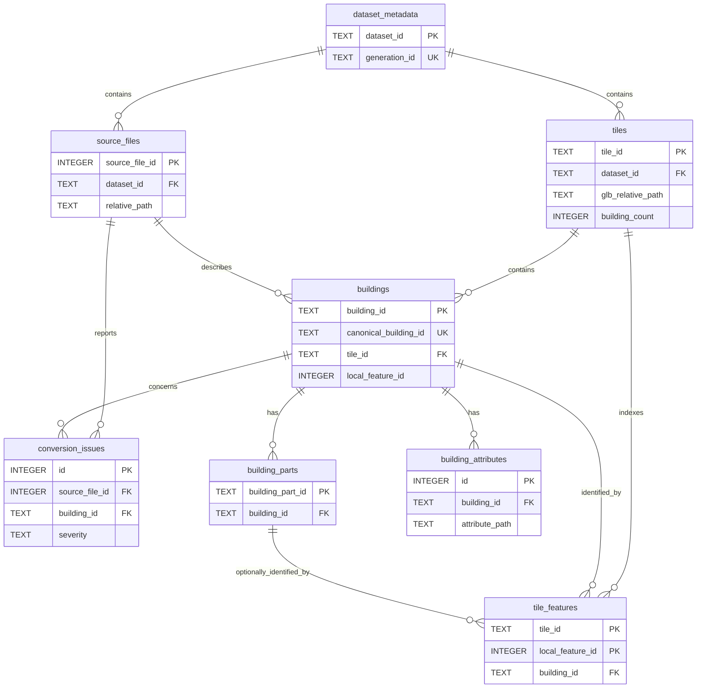

# SQLiteデータベース定義

## 位置づけ

本書は、`contracts/sql/001_initial.sql` に定義された出力SQLiteデータベースを閲覧するためのER図です。SQLマイグレーションを正本とし、本書は設計意図と参照方法を説明します。

## ER図

`schema_migrations` はマイグレーション履歴を保持する管理テーブルで、他テーブルからの外部キー参照はありません。

## 現在の対象範囲

現在のスキーマとconverterは建物（`Building` / `BuildingPart`）を対象とします。地形、道路、水部などの非建物地物を格納するテーブルや共通地物IDはまだありません。

将来は共通の `features`（地物種別、恒久ID、タイル内feature IDなど）と `feature_attributes`（名前空間、属性パス、型、値）を導入し、建物固有情報は `buildings` に残す方針です。変更は新しいマイグレーションで行います。

## 関連資料

- [日本語データ辞書](data-dictionary.md)
- [出力データ形式](data-format.md)
- [正本SQL](../contracts/sql/001_initial.sql)
